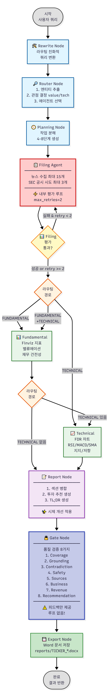

# Stock Analysis Agent System

본 프로젝트는 **전기차 회사 주식 투자 분석 자동화** 에이전트를 설계하고 구현한 실습 프로젝트입니다.  
세상에는 가치 투자자와 기술 투자자가 존재합니다. 기호에 맞춰, 가치 투자를 묻는 쿼리라면 가치 투자 루트를,  
기술 투자를 묻는 쿼리라면 기술 투자 루프를 지나치도록 만들었습니다.

## Overview

- **Objective** : 뉴스, 공시, 재무제표 등 다양한 소스를 종합하여 특정 종목에 대한 투자 리포트를 자동 생성
- **Methods** : Multi-Agent System, Quality Gate, Retry Logic, Source Validation
- **Tools** : LangGraph, Tavily Search API, SEC EDGAR, Finviz, FinanceDataReader

## Features

- **다중 에이전트 협업** : Filing, Fundamental, Technical 에이전트가 역할 분담하여 종합 분석 수행
- **자동 품질 관리** : 에이전트별 평가자(Evaluator)가 실시간으로 출력 품질을 검증하고 자동 재시도
- **자연스러운 한국어 생성** : 시제 프롬프팅 최적화로 과거/현재/미래를 구분하는 전문적인 한국어 리포트 생성
- **출처 기반 분석** : Bloomberg, Reuters, WSJ 등 신뢰도 높은 소스를 우선 수집하여 근거 있는 분석 제공
- **자동 문서화** : 분석 결과를 Markdown과 Word(.docx) 형식으로 자동 저장

## Tech Stack

| Category | Details |
|------------|------------------------------|
| Framework | LangGraph, Python 3.10+ |
| LLM | GPT-4o-mini via OpenAI API |
| Data Sources | Tavily API, SEC EDGAR, Finviz, FinanceDataReader |
| Document | python-docx, Markdown, Matplotlib |
| Validation | Custom Quality Gate, LLM-based Contradiction Check |

## Agents

- **Filing Agent**: 뉴스 및 SEC 공시를 수집하고 사업 동향, 제품 포트폴리오, 매출 정보를 추출 (내부 retry 로직 포함)
- **Fundamental Agent**: Finviz에서 밸류에이션 멀티플(P/E, P/B, PEG 등)과 재무 건전성 지표를 수집하여 가치투자 관점 분석
- **Technical Agent**: FinanceDataReader로 주가 데이터를 수집하고 RSI, MACD, SMA를 계산하여 기술적 분석 및 차트 생성

## State

LangGraph의 `AgentState`는 파이프라인 전체에서 공유되는 상태입니다:

- **query** : 사용자 입력 질의 (예: "TSLA 가치투자 분석")
- **entity** : 추출된 기업 정보 (name, ticker, exchange, confidence)
- **perspective** : 투자 관점 (value | tech)
- **route** : 실행할 에이전트 경로 (["FILING", "FUNDAMENTAL"] 또는 ["FILING", "TECHNICAL"])
- **sources** : 수집된 모든 소스 목록 (domain, title, url, priority 포함)
- **sections** : 에이전트별 생성된 분석 섹션 (business, value, tech, risks, recommendation)
- **tables** : 구조화된 데이터 테이블 (rev_compare, finviz_blocks, technicals)
- **evals** : 에이전트별 평가 결과 (sufficient, coverage_ok, sources_ok 등)
- **report_md** : 최종 생성된 Markdown 리포트
- **gate_feedback** : 품질 검증 피드백 (참고용, 루프 없음)
- **docx_path** : 저장된 Word 문서 경로

## Architecture



**주요 개선사항:**
- Gate 실패 시 루프 제거 → Filing Agent 내부 평가만 retry 수행
- 시제 프롬프팅 개선 → 자연스러운 한국어 생성 (과거: ~했다, 현재: ~하고 있다, 미래: ~할 예정이다)

**실행 플로우:**
```
Rewrite → Router → Planning → Filing (retry) → Fundamental/Technical → Report → Gate → Export
```

## Directory Structure

```
├── agents.py                    # 에이전트 모듈 (Filing, Fundamental, Technical)
├── report_agent.py              # 리포트 생성 및 Word 문서 저장
├── gate.py                      # 품질 검증 게이트 (8가지 기준)
├── langgraph_main.py            # LangGraph 파이프라인 (개선된 버전)
├── main.py                      # 기존 순차 실행 파이프라인
├── diagram/
│   └── ai_service_mini.png      # 아키텍처 다이어그램
├── reports/                     # 생성된 리포트 저장
│   ├── TSLA_20241023_1430.md
│   └── TSLA_20241023_1430.docx
├── artifacts/                   # 차트 및 기타 산출물
│   └── TSLA_daily.png
├── .env                         # API 키 설정
└── README.md

```

## Usage

### 1. 환경 설정

```bash
# 패키지 설치
pip install -r requirements.txt

# API 키 설정 (.env 파일)
OPENAI_API_KEY=your_openai_api_key
TAVILY_API_KEY=your_tavily_api_key
SEC_USER_AGENT=your_email@example.com
```

### 2. 실행

```bash
# 대화형 모드 (LangGraph 버전)
python langgraph_main.py

# 또는 기존 순차 실행
python main.py
```

### 3. 예시

```
You> TSLA 가치투자 분석

🛠️  [Rewrite] 라우팅 전 쿼리 리라이팅...
✅ [Rewrite] Tesla TSLA value investment analysis

🔎 [Router] 쿼리 해석 및 라우팅...
✅ [Router] route=['FILING', 'FUNDAMENTAL'] perspective=value

📋 [Run] Filing & Business Agent...
[NEWS] 📰 Comprehensive news search for TSLA...
✅ Retrieved 15 articles from 8 sources

📊 [Run] Fundamental Analysis...
✅ FUNDAMENTAL completed

📝 [Report] 텍스트 합성
🔒 [Gate] 최종 품질 점검
✅ [Gate] Passed

💾 [Export] Word(.docx) 저장
📄 [Export] saved: reports/TSLA_20241023_1430.docx

▶ 티커: TSLA | 관점: value | 경로: ['FILING', 'FUNDAMENTAL']
▶ TL;DR: Tesla(TSLA): 뉴스 및 공시 기반 가치 관점 분석 (2024-10-23)
▶ Gate Passed: True
▶ Word: reports/TSLA_20241023_1430.docx
```

## Quality Assurance

### 에이전트별 평가 (Agent-level Evaluation)

Filing Agent는 내부적으로 품질 평가를 수행하고 최대 2회 재시도:

- **Coverage**: 필수 주제 80% 이상 포함
- **Grounding**: 최소 3개 이상의 소스 기반
- **Source Quality**: 도메인 다양성 2개 이상
- **Contradiction**: LLM 기반 모순 검증
- **Safety**: PII/금지어 제거, 최소 길이 300자

### 최종 품질 검증 (Gate Validation)

Gate는 8가지 기준으로 최종 품질을 검증하지만, **실패해도 루프를 돌지 않고** 피드백만 제공:

1. Coverage (70%): 필수 섹션 포함 여부
2. Grounding: 충분한 소스 기반 (최소 3개)
3. Contradiction: 모순 없음
4. Safety & Style: PII 없음, 최소 길이 500자
5. Sources: 도메인 다양성 3개 이상, 신뢰 소스 2개 이상
6. Business: 사업 분석 섹션 포함
7. Revenue: 매출 데이터 포함 (선택적)
8. Recommendation: 투자 추천 포함

## Key Improvements

### 1. Gate 루프 제거 ✅

**Before:**
```
Gate 실패 → Filing부터 재시도 (무한 루프 위험)
```

**After:**
```
Gate → Export (직접 연결, 피드백만 제공)
에이전트별 평가만 retry 수행
```

### 2. 시제 문제 해결 ✅

**Before (부자연스러운 한국어):**
- "2023년 모델을 출시한다" ❌
- "현재 판매한다" ❌

**After (자연스러운 한국어):**
- "2023년 모델을 출시했다" ✅
- "2024년 현재 판매하고 있다" ✅
- "2025년 상반기 출시 예정이다" ✅

**프롬프팅 개선:**
```python
sys = f"""Current year is {current_year}.

⚠️ CRITICAL - USE NATURAL KOREAN TENSE:
- Past events: '~했다', '~을 기록했다'
- Current: '~하고 있다', '~이다'
- Future: '~할 예정이다', '~할 것으로 예상된다'

Example: '2023년 출시했다' (NOT '출시한다') 
"""

```
## Contributors

- **고경남**: Design & Implementation

## References

- [LangGraph Documentation](https://langchain-ai.github.io/langgraph/)
- [Tavily Search API](https://tavily.com/)
- [SEC EDGAR](https://www.sec.gov/edgar)
- [Finviz](https://finviz.com/)
- [FinanceDataReader](https://github.com/FinanceData/FinanceDataReader)
